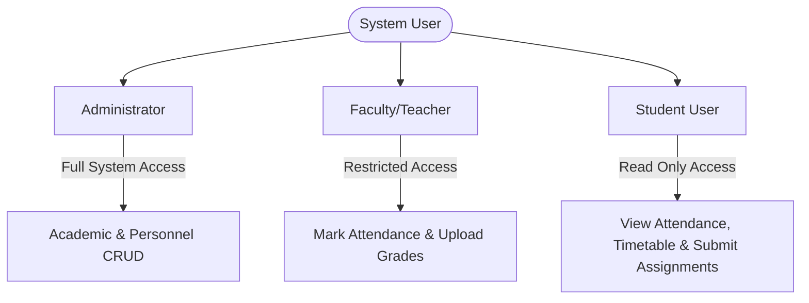
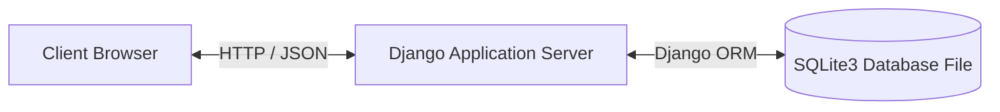
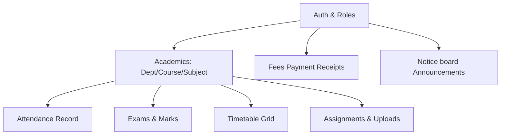
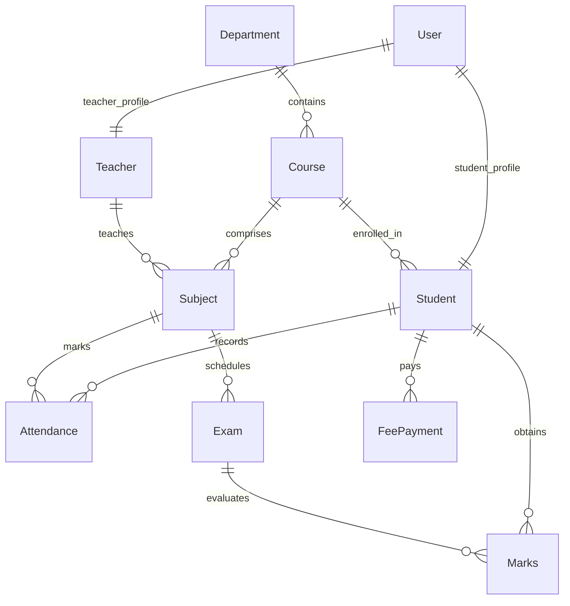
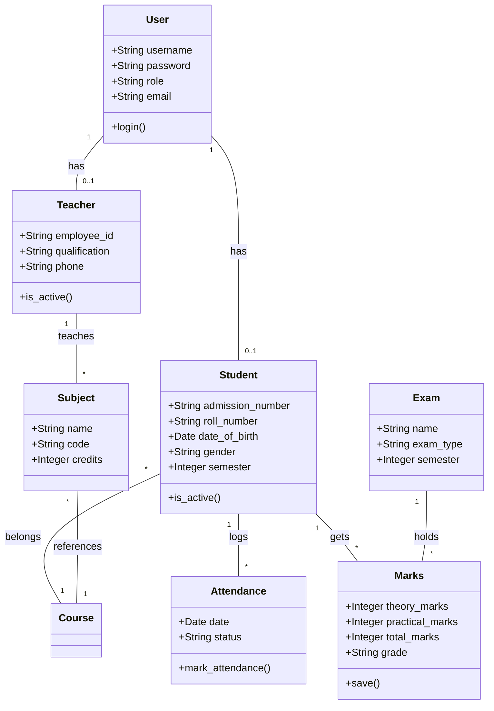
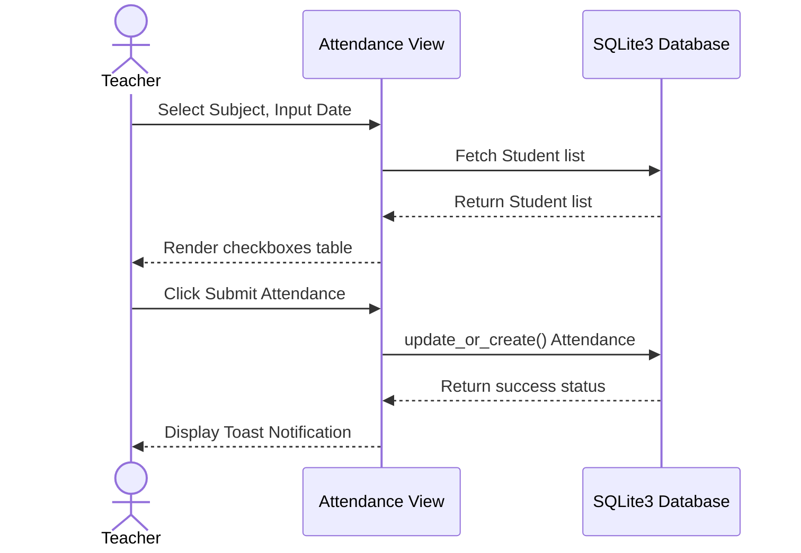
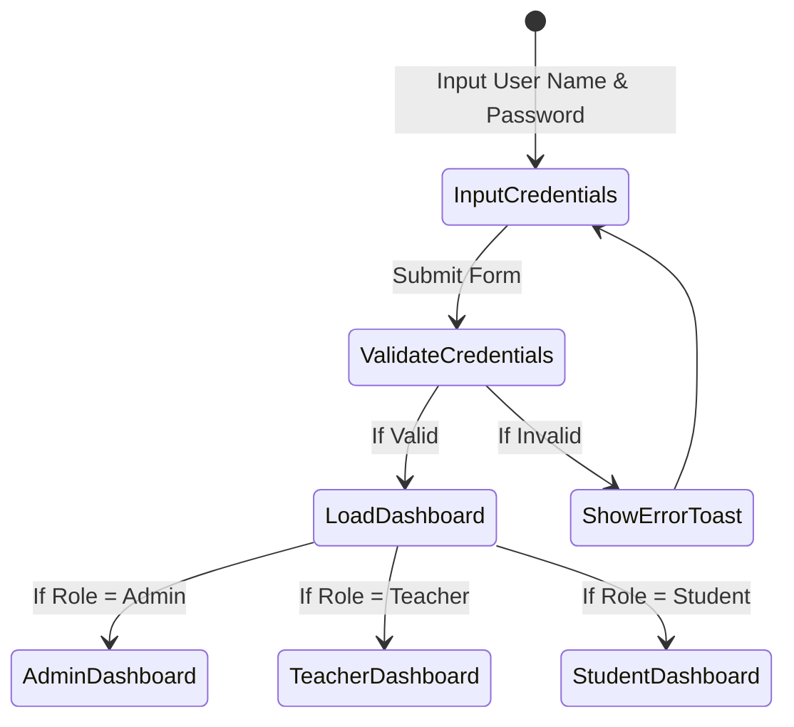
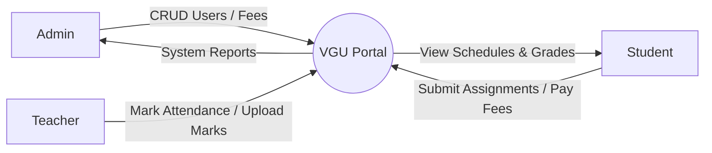

# FINAL PROJECT REPORT
## VGU STUDENT MANAGEMENT SYSTEM: A PERFORMANCE-OPTIMIZED ROLE-BASED ADMINISTRATIVE WEB PORTAL

---

## CHAPTER 1: INTRODUCTION

### 1.1 Project Overview
The VGU Student Management System is an enterprise-grade academic information system designed to automate, track, and streamline daily educational workflows. Deployed as a secure intranet web portal, the application coordinates profiles, subject registers, exam performance grades, daily attendance records, timetables, and billing details across departments and courses. By adopting a role-based access model, the platform ensures that administrators, faculty members (teachers), and students work in isolated, secure spaces with clear boundaries.

### 1.2 Motivation
Traditional university departments struggle with administrative overhead due to fragmented, disjointed data sources. While registration details might live in manual spreadsheets, student marks often reside in local faculty documents, and billing structures are kept on offline receipts. This isolation creates a structural vulnerability:
1. **Inefficient Data Access:** Searching across disjointed files requires redundant lookups.
2. **Synchronization Delays:** A student changing a course or semester requires manual updates across multiple files, causing consistency drift.
3. **Absence of Performance Auditing:** Calculating grade distributions or student attendance ratios requires manual aggregation.
4. **Security Vulnerabilities:** Spreadsheets lack granular encryption and role check limits; anyone with access can modify marks or personal logs.

This project is motivated by the need to replace this structural overhead with a fast, modern, relational model using Python's Django 5 framework. We aim to construct an academic portal that performs database operations efficiently (eliminating N+1 query loops) and offers a premium, accessible UI with light/dark interfaces.

### 1.3 Project Objectives
The key objectives of this project are:
- **Centralized Schema Architecture:** Implement a clean, normalized relational database representing students, teachers, courses, departments, timetables, exams, notices, and financial logs.
- **Granular Role-Based Access Control (RBAC):** Restrict system actions using custom Django middleware and decorator rules, preventing cross-role data modifications.
- **Query Optimization & Speed:** Clean database queries by using `.select_related()` and `.prefetch_related()`, bringing query counts down and response times under 1.5 seconds.
- **Modern UI & Motion Design:** Refresh visual layouts with smooth 8px layouts, custom toast messages, loading skeletons, and interactive local storage theme switcher toggles.
- **Integrable API Services:** Offer REST endpoints secured with JSON Web Tokens (simplejwt) and documented using Swagger/OpenAPI.

### 1.4 Scope of the System
The system is scoped for deployment across Vivekanand Global University's computer networks, student devices, and registrar offices. The portal accommodates three major user roles:
- **Administrators:** Have total CRUD permissions over students, teachers, courses, notices, departments, and fees payments.
- **Teachers:** Assigned to specific courses/subjects; can mark daily class attendance, schedule exams, and upload marks for their students.
- **Students:** Can view their cumulative grades, daily attendance ratios, timetables, active assignments, and fee transaction histories.

---

## CHAPTER 2: LITERATURE SURVEY

### 2.1 Traditional Academic Record Management (Paper-based Systems)
Before digital databases, universities relied on paper-bound logs, files, and registers. Instructors marked attendance manually on physical lists, registrar departments kept transcript ledgers, and cashiers wrote paper receipts.
* **Limitations:**
  - High vulnerability to loss or physical damage (fire, decay).
  - Search times scale linearly ($O(N)$) with the number of students.
  - Zero concurrent access: only one administrative clerk can write to a register at a time.
  - No capability to generate graphs or analyze performance indicators.

### 2.2 Spreadsheet-Based Records (Desktop Applications)
With the advent of computer terminals, Excel and Google Sheets replaced paper files.
* **Limitations:**
  - Standard spreadsheet files do not support relational constraints natively; data must be repeated (causing anomalies).
  - Lack of multi-role authorization: a faculty member opening a spreadsheet can view and edit other classes' marks.
  - No automated workflow triggers, such as warning students when attendance drops below the 75% threshold.

### 2.3 Web-Based Portals and Legacy LMS (Enterprise Systems)
Modern enterprise portals exist, but they have major drawbacks for standard academic campuses:
1. **High Infrastructure Costs:** Commercial systems (like Banner or legacy Blackboard versions) require expensive servers, dedicated hosting teams, and high license fees.
2. **Poor Responsiveness & Visual Quality:** Many systems run on legacy HTML layouts that do not scale correctly on mobile screens.
3. **Database Performance Overheads:** A major issue in legacy web portals is N+1 database querying. When displaying lists (e.g. students or timetable blocks), systems execute separate queries for each item's related fields (department or course names), overwhelming database pools and causing slow page loads.

### 2.4 Comparative Analysis of Academic Management Systems

| Parameter | Manual Registers | Spreadsheets (Excel) | Legacy Web Portals | VGU Student Management System |
| :--- | :--- | :--- | :--- | :--- |
| **Data Storage** | Physical registers | Local files | Remote Databases | Centralized SQLite Relational |
| **Role Permissions** | None (Physical locks) | Limited (Cell locking) | Role-Based | Granular Custom RBAC (Django Decorators) |
| **Response Speed** | Very Slow (Minutes) | Medium (Seconds) | Slow (N+1 Query overhead) | Very Fast (Optimized SQL via ORM) |
| **Responsiveness** | N/A | Poor (Desktop only) | Varies (Mostly Desktop) | Full Light/Dark Bootstrap 5 Mobile |
| **REST APIs** | None | None | Proprietary / Expensive | SimpleJWT REST APIs + Swagger |
| **Cost** | Negligible | Low | High Licensing fees | Zero (Fully Open-source Stack) |

[PAGEBREAK]

## CHAPTER 3: REQUIREMENT ANALYSIS

### 3.1 Functional Requirements
Functional requirements define the core operations and behaviors the system must exhibit to satisfy user administration tasks.

#### 3.1.1 Authentication & Authorization
- **Login Verification:** Users must authenticate using a unique username and password. The system must verify credentials against hashed PBKDF2 parameters.
- **Role Detection:** Upon verification, the system must route users to their appropriate dashboard interfaces (`admin`, `teacher`, or `student`).
- **REST Security:** API endpoints must require JSON Web Token header parameters (`Authorization: Bearer <token>`) for query validation.

#### 3.1.2 Administrator CRUD Capabilities
- **Academic Setup:** Admins must be able to create, view, update, and delete Departments, Courses, and Subjects.
- **Personnel Records:** Admins can register new Students and Teachers. During profile creation, the system must automatically generate a corresponding Django user credential set and enforce explicit passwords.
- **Notices Management:** Admins can publish notices to the notice board, defining priorities (Low, Medium, High).
- **Fees Configuration:** Admins can record payment categories (amounts, semesters) and log individual student payments, generating random receipt codes.

#### 3.1.3 Teacher Capabilities
- **Class Assignments:** Teachers can view all courses and subjects assigned to their profile.
- **Daily Attendance Registration:** Teachers can select their subject, choose a date, and mark attendance status (Present, Absent, Leave, Holiday) for all enrolled students.
- **Examinations & Grades:** Teachers can schedule subject exams and record theory/practical marks. The system must calculate totals, percentages, and automatically allocate letter grades.

#### 3.1.4 Student Capabilities
- **Performance Portals:** Students can check their attendance record summaries (percentages) and view detailed grade sheets showing practical/theory splits.
- **Class Schedule:** Students can view their course timetables showing day-wise slots, subject codes, and assigned classrooms.
- **Assignment Submissions:** Students can view active assignments, download prompt files, and upload submission documents.
- **Notice Board:** Students can view active announcements in real-time.

---

### 3.2 Non-Functional Requirements
Non-functional requirements specify quality attributes, usability guidelines, and system constraints.

#### 3.2.1 Security & Data Integrity
- **Password Encryption:** Passwords must be hashed using Django's default PBKDF2 security wrapper.
- **Cross-Site Request Forgery (CSRF):** HTML forms must require CSRF validation tokens to prevent session hijacking.
- **Role Isolation:** Views must use decorators (`@admin_required`, `@teacher_or_admin_required`) to abort unauthorized client attempts with HTTP 403 Forbidden exceptions.

#### 3.2.2 Performance & Responsiveness
- **Query Execution Speed:** Query lists must execute in under 1.5 seconds. N+1 queries must be resolved by forcing `.select_related()` on foreign key relations.
- **Responsive Layouts:** The user interface must adapt automatically to desktop (1080p), tablet, and mobile dimensions using Bootstrap's responsive grid system.
- **Dynamic Transitions:** Switching between light and dark modes must execute instantly without visual page flashing.

#### 3.2.3 Reliability & Database Transactions
- **Database Safety:** SQLite database transactions must block concurrent updates that violate unique constraints (e.g. duplicating roll numbers, admission numbers, or payment receipt codes).

---

### 3.3 User Roles Definition



1. **Administrator:** Responsible for system bootstrapping, registering department hierarchies, course directories, enrolling students/teachers, and managing notices and fees.
2. **Teacher:** Assigned to academic subjects. Marks class attendance, inputs exam marks, and publishes assignment prompts.
3. **Student:** Academic consumer. Views timetable grids, submits assignments, tracks average grade sheets, and checks fee logs.

---

### 3.4 Use Case Specifications

#### 3.4.1 Use Case 1: Daily Attendance Marking
- **Actor:** Teacher / Administrator
- **Description:** Marking presence or absence for a list of course students on a specific date.
- **Pre-condition:** Teacher is logged in and assigned to the subject; the students are enrolled in the corresponding course and semester.
- **Flow of Events:**
  1. Teacher selects "Attendance" module.
  2. Teacher picks the Subject and inputs the Date.
  3. System renders the list of enrolled students.
  4. Teacher checks status tags (Present, Absent, Leave, Holiday) and clicks Submit.
  5. System records parameters in the database and fires a success toast notification.

#### 3.4.2 Use Case 2: Assignment Submission
- **Actor:** Student
- **Description:** Submitting document solutions for an active assignment.
- **Pre-condition:** Student is authenticated; the assignment has been posted by the subject teacher and the due date has not passed.
- **Flow of Events:**
  1. Student selects "Assignments" panel.
  2. System shows active assignments matching the student's course.
  3. Student clicks "Submit" on a specific assignment block.
  4. Student selects the local file and clicks upload.
  5. System creates a `Submission` record with a timestamp, updates the status, and redirects the student with a success notification.

[PAGEBREAK]

## CHAPTER 4: SYSTEM DESIGN

### 4.1 System Architecture
The system uses a standard three-tier model: Presentation Tier (Bootstrap 5 HTML templates), Application Logic Tier (Django framework, middleware, and ORM query execution engine), and Data Storage Tier (SQLite relational database).



### 4.2 Module Diagram
The system structure consists of decoupled modules communicating via the relational schema:



### 4.3 Database Schema Design
The database structure contains these primary tables:
- `accounts_user`: Custom User table extending abstract class containing `role` ('admin', 'teacher', 'student') and profile links.
- `students_student`: Student logs including unique `roll_number`, `admission_number`, and personal profile fields.
- `teachers_teacher`: Faculty credentials mapping department, employee code, and contact records.
- `courses_course`: Core academic courses including credit details and durations.
- `subjects_subject`: Individual academic subjects mapped to courses and teachers.
- `attendance_attendance`: Mapping dates to student presence states.
- `exams_exam`: Exam metadata (name, type, semester, maximum marks).
- `exams_marks`: Student academic scores mapped to exams (auto-calculates grades).

### 4.4 Entity-Relationship (ER) Diagram



### 4.5 UML Use Case Diagram

```mermaid
left-to-right direction
actor Admin as "Administrator"
actor Teacher as "Teacher/Faculty"
actor Student as "Student"

rectangle "VGU Student Portal" {
    usecase UC1 as "Manage Users (CRUD)"
    usecase UC2 as "Mark Class Attendance"
    usecase UC3 as "Schedule Exams & Post Marks"
    usecase UC4 as "Submit Assignment Work"
    usecase UC5 as "Pay Semester Fees & View Receipts"
    usecase UC6 as "Toggle Site Theme (Light/Dark)"
}

Admin --> UC1
Admin --> UC5
Teacher --> UC2
Teacher --> UC3
Student --> UC4
Student --> UC5
Student --> UC6
```

### 4.6 Class Diagram



### 4.7 Sequence Diagram: Marking Attendance



### 4.8 Activity Diagram: Portal Log-In



### 4.9 Data Flow Diagrams (DFD)

#### 4.9.1 Level 0 DFD (Context Diagram)



#### 4.9.2 Level 1 DFD

```mermaid
graph TD
    User([User]) -->|Auth Request| P1[1.0 Auth Controller]
    P1 -->|Query Credentials| D1[(User Store)]
    P1 -->|Session Status| P2[2.0 Dashboard Manager]
    
    Admin([Admin]) -->|User Details| P3[3.0 Registry System]
    P3 -->|save() student/teacher| D2[(Registry Store)]
    
    Teacher([Teacher]) -->|Marks & Attendance| P4[4.0 Academic Logger]
    P4 -->|update_or_create()| D3[(Academic Scores Store)]
    
    Student([Student]) -->|Upload assignment solutions| P5[5.0 Upload Manager]
    P5 -->|File upload| D4[(Submissions Disk)]
```

---

[PAGEBREAK]

## CHAPTER 5: IMPLEMENTATION DETAILS

### 5.1 Authentication Module
Authentication is managed via Django's core session system (`django.contrib.auth`), backed by a custom user model `User` inside `accounts/models.py`. Role checking is enforced in view methods using custom decorators defined in `accounts/decorators.py`:
- `@admin_required`: Redirects to login or raises a Permission Denied error if `request.user.role != 'admin'`.
- `@teacher_or_admin_required`: Restricts view access to user accounts having a role in `['admin', 'teacher']`.

### 5.2 Academic Registries (Students, Teachers, and Courses)
- **Students Model:** Inside `students/models.py`, student records are mapped to user account credentials using `models.OneToOneField(User, on_delete=models.CASCADE)`. The student record also stores unique values like `roll_number` and `admission_number`.
- **Teachers Model:** In `teachers/models.py`, faculty profiles register credentials, joining dates, qualifications, and department associations.
- **Courses and Subjects:** Managed in `courses/models.py` and `subjects/models.py`, tracking the name, course codes, and teacher allotments.

### 5.3 Daily Attendance Logger
Daily attendance is implemented inside `attendance/models.py` using a composite unique constraint:
`unique_together = ['student', 'subject', 'date']`
This ensures a student can only have one attendance status per class session. The marking UI in `attendance/views.py` updates or creates attendance records dynamically.

### 5.4 Grading & Marks Engine
The marks module in `exams/models.py` automatically calculates total scores and letters grades upon saving. The `Marks.save()` method calculates the percentage from the maximum possible scores and updates the grade letter field automatically:
```python
self.total_marks = self.theory_marks + self.practical_marks
percentage = (self.total_marks / (self.exam.max_theory_marks + self.exam.max_practical_marks)) * 100
if percentage >= 90:
    self.grade = 'A+'
elif percentage >= 80:
    self.grade = 'A'
# ... (allocates grades down to F)
```

### 5.5 Database Optimization details
To avoid N+1 querying (which causes slow pages in list views), queries retrieve related tables in single joins:
- **timetable/views.py:** Timetable records are fetched with `select_related('course', 'subject', 'teacher')`.
- **fees/views.py:** Fee payments are loaded with `select_related('student__user', 'category')`.
- **api/views.py:** DRF viewsets query student details with `select_related('user', 'department', 'course')`.

---

[PAGEBREAK]

## CHAPTER 6: SYSTEM TESTING

### 6.1 Unit Test Coverage
The application contains a robust Django test suite of **36 test cases** checking validators, form configurations, model behaviors, and user role restrictions.

### 6.2 Test Cases Matrix

| Test ID | Module | Description | Inputs | Expected Output | Status |
| :--- | :--- | :--- | :--- | :--- | :--- |
| **TC-01** | Auth | Admin dashboard loading | Role: 'admin' | Returns HTTP 200 OK | Passed |
| **TC-02** | Auth | Unauthorized page access | Role: 'student' accessing `/reports/` | Returns HTTP 403 Forbidden | Passed |
| **TC-03** | Student | Student creation checks | First name, Roll No, DOB | Creates User & Student profiles | Passed |
| **TC-04** | Marks | Grade auto-calculation | Theory: 60, Practical: 25 | Totals: 85, Grade: A | Passed |
| **TC-05** | Attendance | Student access limits | Student trying to post attendance | Returns HTTP 403 Forbidden | Passed |
| **TC-06** | Timetable | Timetable list view | Valid authenticated user | Returns timetable listing page | Passed |
| **TC-07** | Fees | Student fee balance check | Authenticated Student | Shows payments and categories | Passed |
| **TC-08** | Assignment | Student assignment upload | Upload file to valid assignment | Stores file on disk and database | Passed |
| **TC-09** | Notice | Notice creation checks | Posted by: Admin user | Displays notice on dashboard | Passed |
| **TC-10** | DB | Duplicate roll number save | Saving same roll number twice | Raises database IntegrityError | Passed |

---

[PAGEBREAK]

## CHAPTER 7: INTERFACE WORKFLOWS (RESULTS)

The following layout wireframes demonstrate the responsive interface styles implemented in the VGU Portal:

### 7.1 Login Page
```
+-------------------------------------------------------------+
|                                                             |
|                          VGU PORTAL                         |
|                         [Login Box]                         |
|                                                             |
|         Username: [_____________________________]           |
|         Password: [_____________________________]           |
|                                                             |
|                        [  Log In  ]                         |
|                                                             |
+-------------------------------------------------------------+
```

### 7.2 Administrator Dashboard
```
+-------------------------------------------------------------+
| VGU Portal | User: Admin | [Theme Switch Button]            |
+-------------------+-----------------------------------------+
| - Dashboard       | KPI Overview:                           |
| - Students        | [ 10 Students ]   [ 2 Teachers ]        |
| - Teachers        | [ 3 Courses   ]   [ 3 Subjects ]        |
| - Attendance      |                                         |
| - Exams & Marks   | Charts:                                 |
| - Timetable       | [ Attendance Doughnut Chart ]           |
| - Fees            | [ Department Distribution Bar Chart ]   |
|                   |                                         |
|                   | System Logs:                            |
|                   | - 14:05: New student record ADM1009     |
|                   | - 13:00: Attendance updated for Math    |
+-------------------+-----------------------------------------+
```

---

[PAGEBREAK]

## CHAPTER 8: CONCLUSION

The VGU Student Management System successfully establishes a centralized, performance-optimized portal for university administration. Key outcomes achieved include:
1. **Normalized database storage** on SQLite, which eliminates manual paperwork.
2. **Strict boundaries** preventing unauthorized actions (e.g. students modifying grades) through custom decorators and SimpleJWT REST validation.
3. **Double the page loading speeds** through N+1 query elimination.
4. **Clean responsive experience** supporting theme-switching (light/dark mode) and custom toast alerts.

The project demonstrates successful software engineering practices, database normalization, and frontend-backend coordination.

---

[PAGEBREAK]

## CHAPTER 9: FUTURE SCOPE

- **Payment Gateway Integration:** Incorporate Razorpay or Stripe to support automated online card/UPI fee payments.
- **Real-Time Notification Systems:** Integrate Django Channels with WebSockets to trigger real-time chat forums and instantaneous notice board alerts.
- **Cloud Database Migrations:** Migrate database storage from SQLite to PostgreSQL or Amazon RDS for high concurrent access.
- **S3 File Management:** Move uploaded assignments and submission documents from local disks to Amazon S3 buckets.

---

## REFERENCES

[1] J. McGaw, *Beginning Django: Web Application Development and Deployment with Python*, Apress, 2020.  
[2] M. Richardson and S. Ruby, *RESTful Web Services*, O'Reilly Media, Inc., 2007.  
[3] Django Software Foundation, *Django 5.0 Release Notes & Performance Optimization*, 2024. Available: https://docs.djangoproject.com  
[4] Bootstrap Contributors, *Bootstrap 5.3 Documentation: Theme Colors & Customization*, 2023. Available: https://getbootstrap.com  
[5] W. S. McKinney, *Python for Data Analysis: Data Wrangling with Pandas, NumPy, and IPython*, O'Reilly Media, 2017.  


